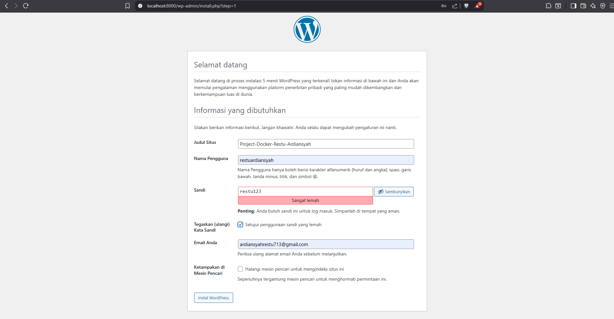
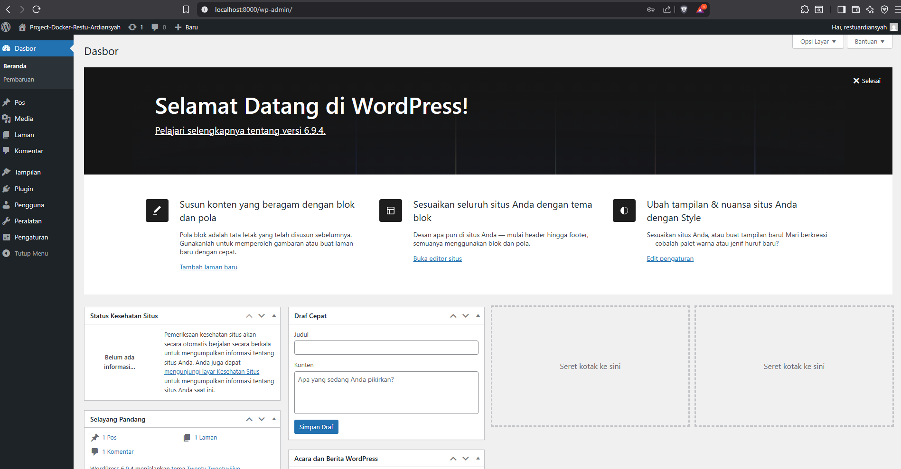
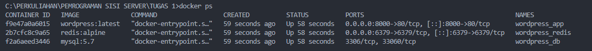
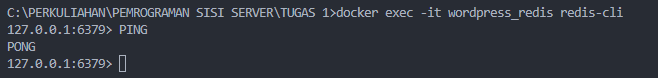

# Panduan Setup WordPress Docker Compose

## Langkah Pengerjaan

### 1. Menjalankan Docker
Buka terminal di folder project, lalu jalankan:

` docker compose up -d `

### 2. Verifikasi Container
Pastikan ketiga container (WordPress, MySQL, Redis) sudah berjalan:

` docker ps `

### 3. Akses dan Instalisasi
Buka browser lalu selesaikan instalasi WordPress pada alamat berikut:

http://localhost:8000

## Lampiran

### 1. Instalisasi Wordpress

### 2. Dashboard Wordpress 

### 3. Verifikasi Container

### 4. Verifikasi Redis
Teriminal Redis:

` docker exec -it wordpress_redis redis-cli PING `

Output:

` PONG `

## Jawaban Pertanyaan
### 1. Kenapa perlu volume untuk MySQL?
Tanpa volume, data di dalam database akan hilang saat container dihapus (bersifat ephemeral). Volume memetakan folder di host machine ke dalam container sehingga data tetap aman meskipun container di-restart atau dibuat ulang.

### 2. Apa fungsi depends_on?
Fungsinya adalah untuk mengatur urutan startup antar service. Dalam kasus ini, WordPress harus menunggu MySQL siap terlebih dahulu agar tidak terjadi error koneksi database saat pertama kali dijalankan.

### 3. Bagaimana cara WordPress container connect ke MySQL?
Menggunakan fitur DNS internal Docker Network. WordPress mengakses MySQL melalui hostname mysql (nama service yang didefinisikan di docker-compose) pada port 3306.

### 4. Apa keuntungan pakai Redis untuk WordPress?
Redis menyimpan hasil query database yang sering diakses ke dalam RAM. Ini mempercepat waktu loading website secara signifikan karena mengurangi beban kerja database MySQL.